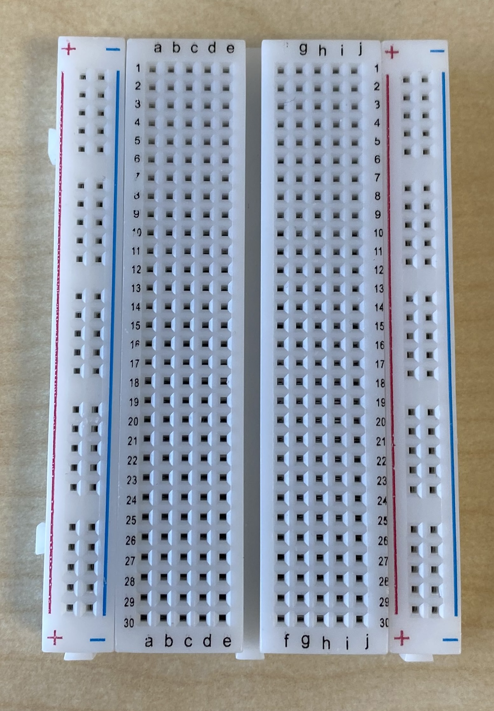
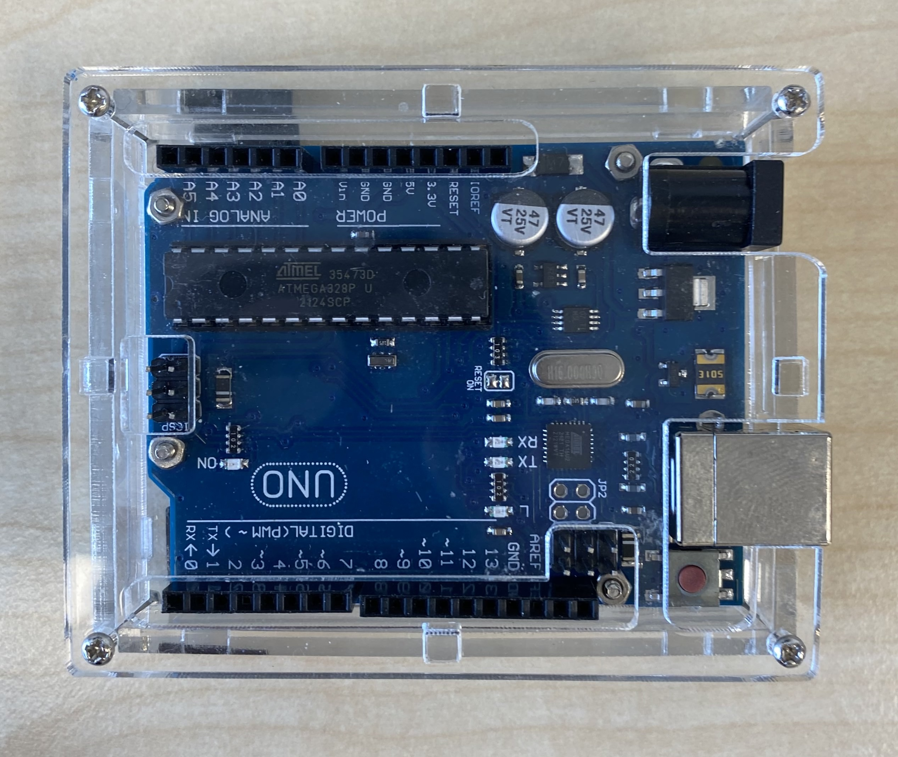
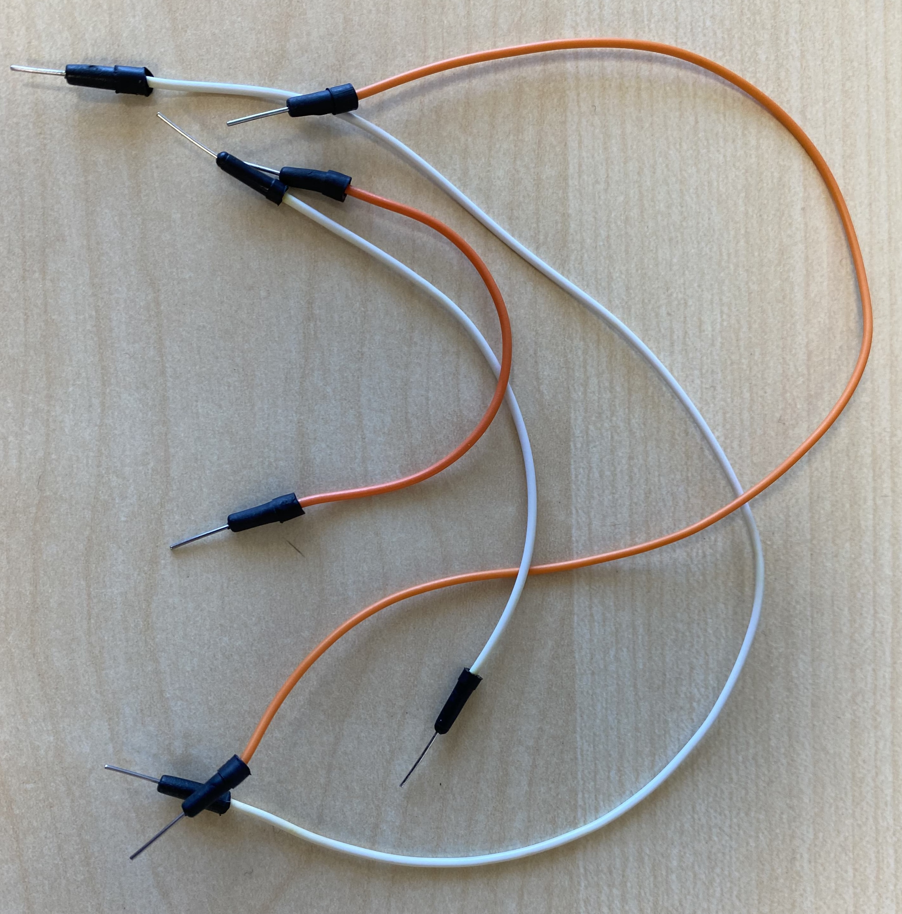
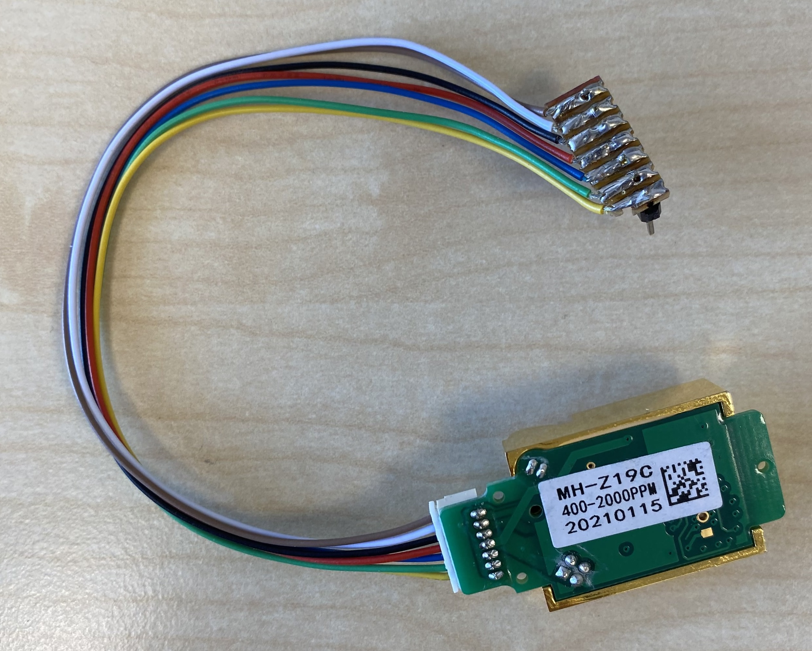
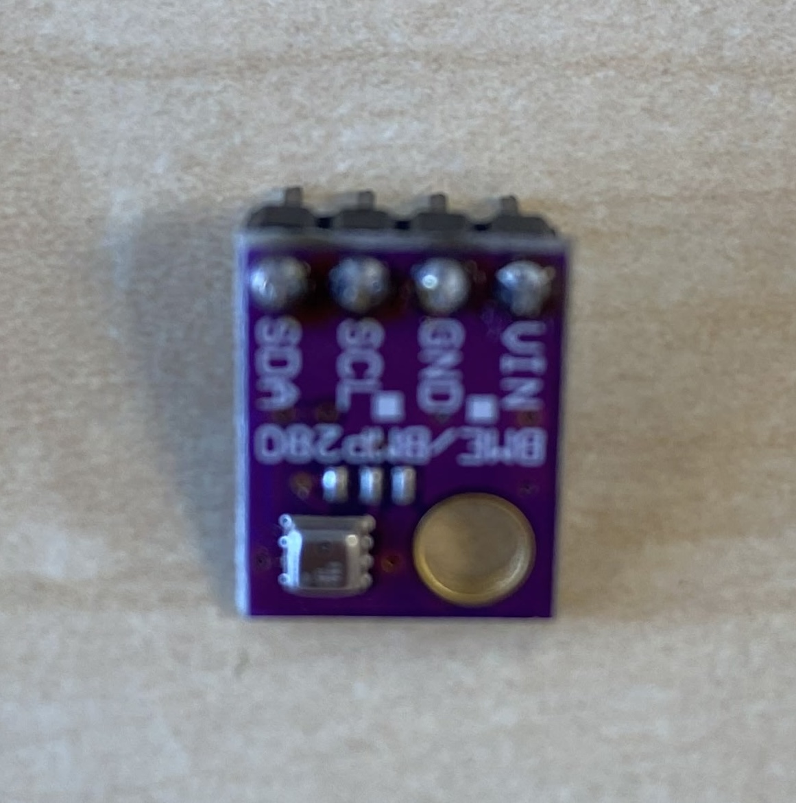
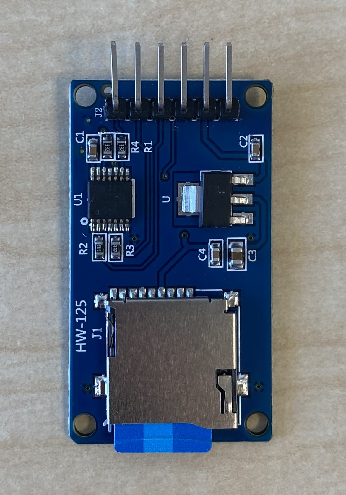
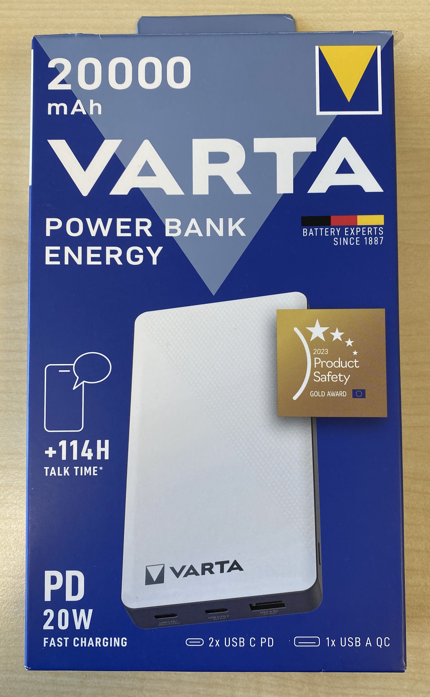
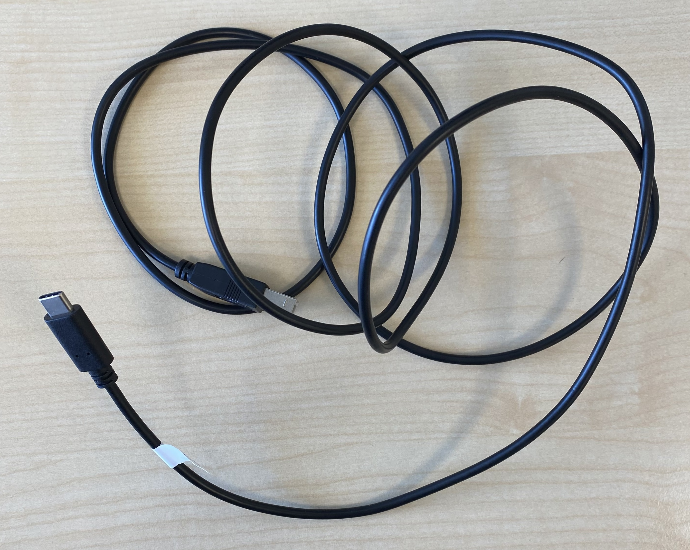

# **Components and Materials**

The following list includes all competent you are handed in at the beginning this project. To build the Arduino CO2 sensor you will only need to use the one marked as yes. 

| Component | Image | Specifications and description | Was it used? |
|---|---|---|---|
| Breadboard | | Allows temporary connections between the Arduino and the other components (sensors and SD card) | Yes |
| Arduino Uno |  |Central microcontroller of the system. It translates the Arduino IDE code to communicate to the sensor, process the measurements and collect the data.    &bull; Model: ATmega38P  &bull; Operating voltage: 5V  &bull; Connection type: USB-C | Yes |
| Cables |  | Connects the different components of the circuit  | Yes |
| CO2 Sensor | | Measures the carbon dioxide concentration in its surroundings using infrared technology    &bull; Model: HH-Z19C  &bull; Manufacturer: Winsen  &bull; Measurement range: 400-2000ppm | Yes |
|P/T/RH sensor| | Sensor module that allows to take extra environmental measurements such as pressure, temperature and relative humidity    &bull; Model: BME/BMP2080 | No |
| SD card and SD reader | | Collects and preserves experimental data for later analysis.  | Yes |
| External battery| | External power supply that allows the Arduino to operate without a continuous connection to the computer. Useful to make long measurements.    &bull; Manufacturer: VARTA  &bull; Maximum charging power: 20W  &bull; Outputs: 2 USB-C and 1 USB-A port | No |
| USB-C cable | | Provides connection between the Arduino ONE and the computer or battery | Yes |
